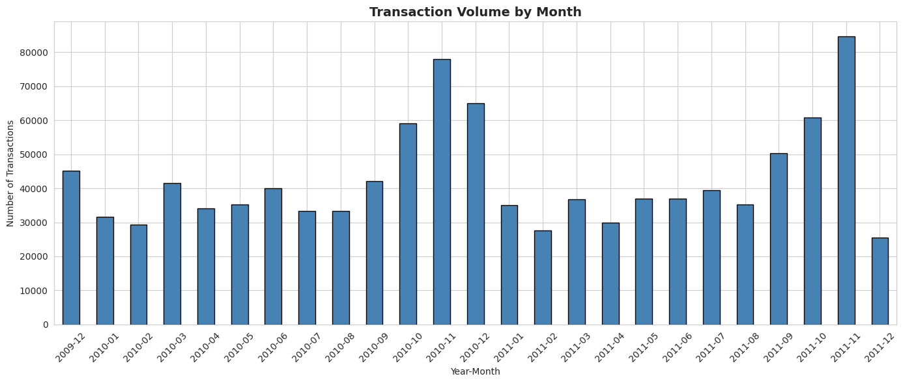
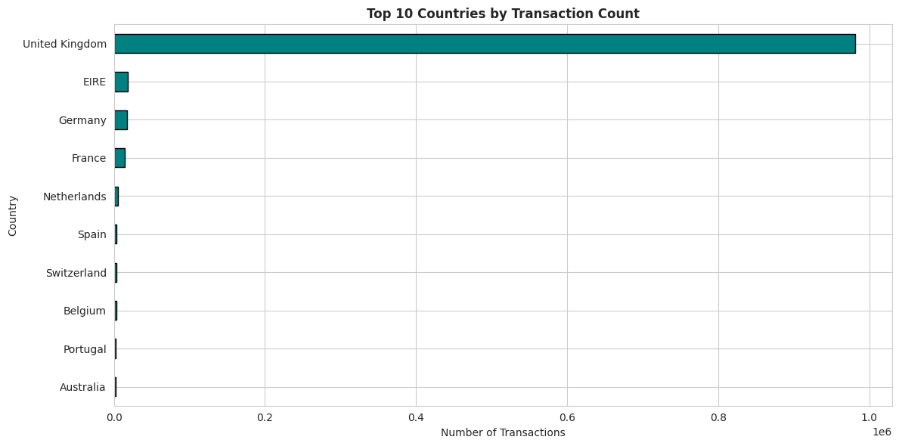
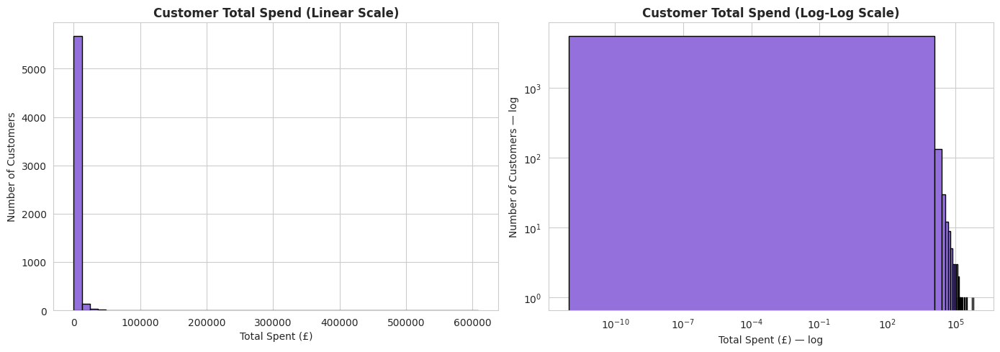
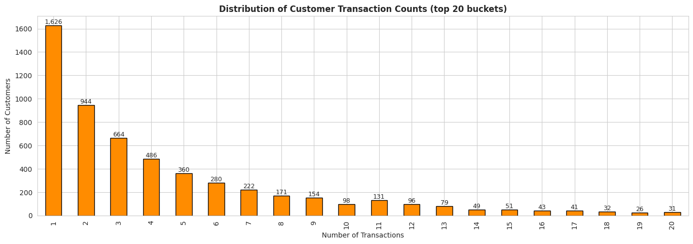
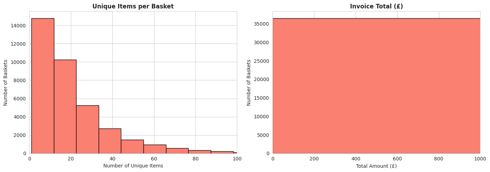

# Online Retail II — EDA Findings

**Project:** Churn-CLV Prediction Suite
**Notebook:** `notebooks/02_eda_retail.ipynb`
**Dataset:** Online Retail II (UCI Machine Learning Repository)
**Total Records:** 1,067,371 transactions
**Date Range:** 2009-12-01 to 2011-12-09 (738 days, ~2 years)
**Purpose:** Foundation for Customer Lifetime Value (CLV) modeling and customer segmentation

---

## Document Structure

- **Section 1:** Executive Summary
- **Section 2:** Dataset Overview
- **Section 3:** Temporal Analysis
- **Section 4:** Geographic Analysis
- **Section 5:** Cancellations and Returns
- **Section 6:** Customer ID Analysis
- **Section 7:** Per-Customer Statistics
- **Section 8:** Pareto Analysis (80/20 Pattern)
- **Section 9:** Customer Spend Distribution
- **Section 10:** Transaction Frequency Distribution
- **Section 11:** Basket Size Analysis
- **Section 12:** Top Products and Anomalies
- **Section 13:** Critical Findings Summary
- **Section 14:** Modeling Decisions
- **Section 15:** Interview Talking Points

---

## 1. Executive Summary

The Online Retail II dataset contains over 1 million transactions from a UK-based online retailer specializing in homewares and gift items. Analysis revealed strong B2B/B2C mixed customer base, severe Pareto distribution (top 5% generate 52% of revenue), and 27.6% single-purchase customers requiring special handling in CLV modeling.

After data quality filtering, **805,620 usable transactions across 5,881 unique customers** remain — a robust foundation for CLV estimation and segmentation. Critical preprocessing decisions involve dropping 22.77% anonymous transactions, 1.83% cancellations, 2.15% returns, and 0.58% zero/negative price entries.

The dataset shows clear seasonal patterns (Christmas pre-order surge in November), 8% year-over-year growth, and an extreme long-tail spend distribution that requires log-transformation for clustering algorithms.

---

## 2. Dataset Overview

### Schema

| Column | Type | Description |
|---|---|---|
| Invoice | object (string) | Invoice ID — 'C' prefix denotes cancellation |
| StockCode | object (string) | Product code (mixed numeric/alphanumeric) |
| Description | object (string) | Product name (with 4 integer anomalies and 4,382 NaN) |
| Quantity | int64 | Units purchased (negative = return) |
| InvoiceDate | datetime64 | Transaction timestamp |
| Price | float64 | Unit price (£) |
| Customer ID | float64 | Customer identifier (NaN for anonymous purchases) |
| Country | object | Customer country |

### Initial Data Quality

| Column | Missing Count | Missing % |
|---|---|---|
| Customer ID | 243,007 | 22.77% |
| All others | 0 | 0% |

### Data Type Issues Discovered

During parquet serialization, two unexpected data quality issues surfaced:

**1. Invoice column has mixed types**
- Most invoices: pure numeric strings (`'536196'`, `'525054'`)
- Cancellations: prefixed with 'C' (`'C552863'`)
- This required explicit `astype(str)` conversion

**2. Description column has 4 integer anomalies**
```
str:    1,062,985  (99.6%)  — normal product names
float:      4,382  (0.4%)   — NaN entries
int:            4  (0.0001%) — admin/inventory adjustment entries
```

The 4 integer descriptions all share a pattern: zero price, NaN customer, often negative quantity, and reference another StockCode in the description field. These are **inventory adjustment entries**, not real transactions.

This kind of operational metadata mixed with transactional data is typical of real warehousing systems and gets filtered during preprocessing.

---

## 3. Temporal Analysis



### Monthly Pattern Statistics

```
Total days:     738 (2 years)
Earliest date:  2009-12-01 07:45:00
Latest date:    2011-12-09 12:50:00
```

### Three Key Temporal Patterns

**1. Christmas Pre-Order Surge (November Peak)**

Both 2010 and 2011 show their **highest volumes in November**, not December:

```
2010-11: 78,015 transactions  ← 2010 peak
2010-12: 65,004 transactions
2011-11: 84,711 transactions  ← 2011 peak
```

This counterintuitive pattern (peak in November rather than December) suggests heavy **B2B pre-order activity** — wholesalers placing Christmas orders in October-November to ensure stock availability for December retail. This is a known pattern for UK gift retailers.

**2. Year-over-Year Growth**

```
2010-11 peak: 78,015
2011-11 peak: 84,711  → +8.6% YoY growth
```

The business is growing modestly. CLV models can assume customer base is expanding, not contracting.

**3. Critical Finding: Truncated Final Month**

```
2011-11: 84,711 transactions
2011-12: 25,526 transactions  ← only 9 days of data!
```

The dataset ends on **2011-12-09**, meaning December 2011 contains only 9 days. Compared to the previous year's 65K December transactions, this is consistent with proportional volume.

**Implication for CLV:** When computing recency, the reference date should be `2011-12-10` (the day after the maximum), not the current date. Using today's date would inflate all recency values by ~14 years and break the model.

### Seasonal Decomposition

```
Jan-Feb:   Low (post-holiday lull)
Mar-Sep:   Stable mid-volume (~30-40K)
Oct-Nov:   Ramp-up (50-85K)
Dec:       Peak (limited by month-end cutoff)
```

Strong seasonality is the dominant temporal signal.

---

## 4. Geographic Analysis



### Country Distribution

```
Total countries:        43
United Kingdom:         981,330  (91.94%)
EIRE (Ireland):          17,866  (1.67%)
Germany:                 17,624  (1.65%)
France:                  14,330  (1.34%)
Netherlands:              5,140  (0.48%)
Other 38 countries:      31,081  (2.91%)
```

### Interpretation

This is a **UK-centric online retailer** with secondary international shipping markets. Top 4 non-UK countries are all geographically close European markets — Ireland, Germany, France, Netherlands.

The "Other 38 countries" combined represent only 2.9% of transactions, with most having fewer than 100 transactions individually.

### Anonymous vs Identified Geographic Pattern

A subtle but interesting finding emerged when splitting by Customer ID presence:

```
Anonymous transactions UK:    98.7% (240,029 / 243,007)
Identified transactions UK:   89.9% (741,301 / 824,364)
```

Anonymous transactions are even more UK-concentrated than identified ones. This makes sense:
- UK domestic guest checkout is more common
- International customers more often create accounts (for tax/customs)

### Modeling Implications

**Country feature engineering options:**
1. **Aggressive simplification:** UK vs Non-UK binary feature
2. **Moderate simplification:** Top 5 countries + "Other"
3. **Full retention:** Use all 43 (high cardinality, sparse signal)

For initial modeling, option 2 (top-5 + Other) balances signal preservation with cardinality reduction.

---

## 5. Cancellations and Returns

### Distribution

```
Total transactions:                    1,067,371
Cancellations (Invoice 'C' prefix):       19,494 (1.83%)
Negative quantity rows:                   22,950 (2.15%)
Both 'C' AND negative quantity:           19,493
Zero quantity rows:                            0
Negative price rows:                           5
Zero price rows:                           6,202
```

### Critical Discovery: Cancellations and Returns Are the Same Thing

```
Cancellations: 19,494
Both 'C' AND negative quantity: 19,493
Coverage: 100.0%
```

**99.99% of cancellations also have negative quantity.** These aren't two separate concepts — they're the same operational event:

When a customer returns/cancels:
1. A new invoice is created
2. The Invoice is prefixed with 'C'
3. The Quantity is the negative of the original (e.g., -3 means 3 units returned)

### The 3,457 Anomalies

```
22,950 negative quantity - 19,493 cancellations = 3,457 anomalies
```

These 3,457 rows have negative quantity but no 'C' prefix. Likely interpretations:
- **Damaged inventory** write-offs
- **Stock adjustment** corrections
- **Manual data entry errors** corrected via reverse entry

These should also be filtered out of any analysis since they're not real customer transactions.

### Sector Context

The 1.83% cancellation rate is **normal for e-commerce** (typical range 1-3% for B2C, 0.5-2% for B2B). This indicates a healthy operation, not a cancellation problem.

### Preprocessing Decision

A single filter is sufficient: `Quantity > 0`. This catches:
- All cancellations (negative quantity)
- All returns (negative quantity)
- All non-anomaly inventory adjustments

No need for separate cancellation flag — the negative quantity filter handles everything.

---

## 6. Customer ID Analysis

### Anonymous Transaction Profile

```
Transactions without Customer ID: 243,007  (22.77%)
Identified unique customers:        5,942
```

### What Anonymous Transactions Look Like

Examining samples reveals two distinct types:

**Type 1: Real anonymous purchases (guest checkout)**
```
StockCode "85226C"  Description "BLUE PULL BACK RACING CAR"  Qty 1   Price £0.55
```
A customer making a normal purchase without creating an account.

**Type 2: Admin/inventory entries**
```
StockCode "21733"   Description "85123a mixed"  Qty -96   Price £0.00
StockCode "85123A"  Description "21733 mixed"   Qty -192  Price £0.00
```
These are **stock corrections** where two products got swapped or mixed — internal operational entries.

### Why Both Must Be Dropped for CLV

CLV modeling requires linking transactions to customers over time. Anonymous transactions cannot be linked, so they're unusable regardless of which type they are.

Dropping all 243,007 NaN customer rows is the correct action — the cost is acceptable since 824,364 identified transactions remain.

### Geographic Concentration

```
Anonymous UK rate:    98.7%
Identified UK rate:   89.9%
```

Anonymous transactions skew even more heavily UK. This pattern is consistent with the explanation that international customers create accounts more often (for tax/customs paperwork).

---

## 7. Per-Customer Statistics

### Aggregate Customer Behavior

After cleaning (removing NaN customers and cancellations):

```
Total unique customers:  5,881
```

### Transaction Count Distribution

| Statistic | Value |
|---|---|
| Mean | 6.29 |
| Median | 3 |
| 25th percentile | 1 |
| 75th percentile | 7 |
| Maximum | 398 |
| Std deviation | 13.0 |

### Spending Distribution

| Statistic | Value (£) |
|---|---|
| Mean | 3,017 |
| Median | 898 |
| 25th percentile | 348 |
| 75th percentile | 2,304 |
| Maximum | 608,822 |
| Std deviation | 14,734 |

### Customer Lifetime Days

| Statistic | Value |
|---|---|
| Mean | 273 days (~9 months) |
| Median | 220 days (~7 months) |
| 25th percentile | 0 days |
| 75th percentile | 511 days (~17 months) |
| Maximum | 738 days (full dataset range) |

### Three Critical Observations

**1. Median is Massively Below Mean**

```
Spending — Mean: £3,017, Median: £898 → ratio 3.4×
Transactions — Mean: 6.3, Median: 3 → ratio 2.1×
```

A 3.4× mean-to-median spending ratio indicates **extreme right-skewness**. Standard retail expects 1.5-2.0× — we're seeing more than 3×, suggesting a small number of mega-customers dominate the average.

**2. Top Customer Made 398 Transactions**

Over 24 months, that's roughly one transaction every two days. This customer profile screams **B2B reseller** — likely a small gift shop or boutique reordering inventory regularly.

**3. Top Customer Spent £608,821**

A single customer accounts for over £600K of revenue. **Losing this customer alone would cause material financial damage.** CLV modeling must accurately predict their continued engagement.

### Customer Lifetime Pattern

The 25th percentile being **0 days** confirms what the transaction frequency analysis will show: a quarter of customers have only one purchase day, meaning they're single-time buyers (or made multiple transactions on the same day).

---

## 8. Pareto Analysis (80/20 Pattern)

### The Numbers

```
Top  5% of customers (294)   generate 52.0% of revenue
Top 10% of customers (588)   generate 63.9% of revenue
Top 20% of customers (1,176) generate 77.3% of revenue
```

### Interpretation

Classical Pareto ("80/20 rule") states that 20% of customers generate 80% of revenue. This dataset shows **even more extreme concentration**:

- **Top 5% generate over half the revenue** — extreme concentration
- Top 20% generate 77% — close to classical Pareto
- The implied bottom 80% generates only 23% of revenue

### Business Implications

**The Champions Segment Is Existential**

These 294 top customers (5% of total) generate 52% of revenue. **If this segment churns, the business loses half its revenue.** Retention investment in this segment has the highest possible ROI.

**The Long-Tail Has Limited ROI Potential**

The bottom 50% of customers (~2,940 customers) generate single-digit percentage of revenue. Marketing campaigns to this segment have low ROI and should be automated rather than personalized.

**Why CLV Modeling Matters Here**

Raw historical spending shows who has been valuable. CLV predicts who **will be** valuable. Identifying tomorrow's Champions before they reach the top 5% allows preemptive retention investment.

---

## 9. Customer Spend Distribution



### Linear Scale (Left Panel)

The linear-scale histogram appears as a single tall bar at the lowest values. This is the visual signature of an **extreme long-tail distribution**:

- ~5,700 customers concentrated in the £0-£20K range
- A handful of mega-customers extend to £600K+
- The mega-customers stretch the x-axis, compressing all other detail

This panel **looks bad on purpose** — it shows that linear scale is the wrong tool for this data.

### Log-Log Scale (Right Panel)

When both axes are logarithmic, the true shape emerges:

- Wide range from very low values to ~£600K
- Approximately linear pattern in log-log space
- This is the **signature of a power-law distribution**

Power-law distributions are well-known in user behavior modeling. They appear in website traffic, social network connections, and customer spending.

### Modeling Implications

**Standard scaling fails here.** StandardScaler computes (x - mean) / std, but mean and std are dominated by outliers, making most customers fall in a tiny range near zero.

**Solution:** Apply log transformation before any distance-based algorithm:

```python
rfm['Monetary_log'] = np.log1p(rfm['Monetary'])
rfm['Frequency_log'] = np.log1p(rfm['Frequency'])
```

Distance metrics in K-Means clustering will then operate on a more uniform scale.

---

## 10. Transaction Frequency Distribution



### The Distribution

```
1 transaction:    1,626 customers (27.6%)
2 transactions:     944 customers (16.1%)
3 transactions:     664 customers (11.3%)
4 transactions:     486 customers (8.3%)
5 transactions:     360 customers (6.1%)
... exponential decay ...
```

### Critical Finding: 27.6% Single-Purchase Customers

This is the most important number in the entire EDA for CLV modeling.

**BG/NBD Model Mathematics**

The Beta-Geometric Negative Binomial Distribution (BG/NBD) model is the foundation for transaction-based CLV. The model uses **frequency** as a parameter, where frequency means the number of **repeat** purchases (total transactions minus 1):

- 1-transaction customer: frequency = 0
- 2-transaction customer: frequency = 1
- 3-transaction customer: frequency = 2

**For frequency = 0 customers, BG/NBD cannot make individual predictions** — there's no repeat behavior pattern to model. The recommended approach: filter these customers out of CLV modeling, treating them as "single-purchase" with their actual one transaction's value.

### Strategy for Single-Purchase Customers

**Approach A (Simple):** Exclude from CLV model
- Modeled customer base: 5,881 → 4,255 (-27.6%)
- Treat single-purchase customers as zero future value

**Approach B (Realistic):** Single-purchase segment with average segment-derived CLV
- Keep them in segmentation
- Assign them average spend value rather than predicted value

For Project 2, Approach A keeps the implementation simple and is justifiable: "Customers without repeat behavior cannot be modeled by BG/NBD; they're tracked separately as a single-purchase segment."

### Pattern Validation

```
1 transaction: 1,626
2 transactions:   944  → 42% drop
3 transactions:   664  → 30% drop
4 transactions:   486  → 27% drop
```

This exponential decay is the **theoretical pattern BG/NBD assumes**. The data fits the model's assumptions, validating the choice of BG/NBD over alternative approaches.

### Repeat Customer Health

```
Single-purchase: 27.6%
Repeat customers: 72.4%
Average repeat count: 8.31 transactions
```

A 72% repeat rate is **strong** — typical retailers see 50-60%. The customer base shows healthy engagement when customers continue past their first purchase.

---

## 11. Basket Size Analysis



### Per-Invoice Statistics

| Statistic | Unique Items | Total Quantity | Invoice Total (£) |
|---|---|---|---|
| Mean | 20.8 | 290 | 480 |
| Median | 15 | 155 | 305 |
| 75th percentile | 27 | 292 | 489 |
| Maximum | 541 | 87,167 | 168,470 |

### Key Observations

**1. Median Basket = 15 Unique Items — This Is B2B Behavior**

Typical B2C retail basket is 3-5 unique items. A median of **15 unique items per basket** suggests the customer base includes substantial B2B/wholesale customers — gift shops, boutiques, and small retailers placing inventory orders.

**2. The £168,470 Single Invoice**

The maximum invoice total is over £168,000. Cross-referencing with the products table:

```
Description: "PAPER CRAFT, LITTLE BIRDIE"
Total Quantity: 80,995
Unique Customers: 1
Transaction Count: 1
```

A **single transaction by a single customer for 80,995 units of one product** — this is either:
- A massive B2B order (likely)
- A data entry error (possible)

Either way, this transaction must be handled carefully. Without outlier capping, it could distort CLV predictions for that one customer.

### Modeling Implications

**B2B/B2C Mixed Customer Base**

Two customer types likely exist:
1. **B2C / Casual:** 1-5 unique items, £20-100 per invoice
2. **B2B / Wholesale:** 50+ unique items, £500+ per invoice

K-Means clustering on customer-level features (RFM) should naturally separate these groups. Each group needs different retention strategies — a casual customer responds to email promotions, while a B2B customer needs an account manager.

**Outlier Strategy**

Extreme values (top 1% by quantity or invoice total) should either be:
- **Capped** at the 99th percentile before modeling
- **Investigated separately** as VIP customers with manual analysis

For RFM-based CLV, log-transformation handles the outlier issue without information loss.

---

## 12. Top Products and Anomalies

### Top Products by Revenue

| Product | Revenue (£) | Customers | Transactions |
|---|---|---|---|
| REGENCY CAKESTAND 3 TIER | 286,486 | 1,314 | 3,318 |
| WHITE HANGING HEART T-LIGHT HOLDER | 252,072 | 1,490 | 4,888 |
| **PAPER CRAFT, LITTLE BIRDIE** | **168,470** | **1** | **1** |
| Manual | 152,341 | 443 | 626 |
| JUMBO BAG RED RETROSPOT | 136,980 | 860 | 2,612 |
| ASSORTED COLOUR BIRD ORNAMENT | 127,074 | 1,010 | 2,652 |
| POSTAGE | 126,563 | 405 | 1,803 |

### Three Anomalies to Discuss

**1. PAPER CRAFT, LITTLE BIRDIE — Single Mega-Transaction**

This product appears as the 3rd highest revenue product but with **1 customer and 1 transaction**. The £168,470 was a single B2B-style order of 80,995 units at £2.08 per unit. This is the same transaction noted in Section 11.

This single data point alone could distort:
- Customer total spend (this customer's lifetime value spikes to £168K+)
- Product popularity ranking (looks popular but isn't, recurring sales)
- CLV predictions (would predict this customer continues at £168K/order)

**2. "Manual" — Not a Real Product**

"Manual" with £152K revenue and 626 transactions is **administrative entry data**, not a sellable product. These rows likely represent:
- Manual price overrides
- Custom orders
- One-off invoice adjustments

These can stay in or be filtered — neither materially affects CLV/segmentation since they're spread across many real customers.

**3. POSTAGE — Shipping Fee, Not a Product**

"POSTAGE" with £126K revenue is the shipping/handling fee charged on international orders. It's not a sellable product in the catalog sense.

For pure product-level analysis, "POSTAGE" should be filtered. For revenue analysis, it's legitimately part of customer spend.

### Real Top Products by Popularity

The most genuinely popular products by transaction count:

```
1. WHITE HANGING HEART T-LIGHT HOLDER: 4,888 transactions, 1,490 customers
2. REGENCY CAKESTAND 3 TIER:           3,318 transactions, 1,314 customers
3. ASSORTED COLOUR BIRD ORNAMENT:      2,652 transactions, 1,010 customers
4. JUMBO BAG RED RETROSPOT:            2,612 transactions,   860 customers
5. PARTY BUNTING:                      2,078 transactions,   894 customers
```

This product mix confirms the retailer's identity: **UK gift and homeware retailer** specializing in vintage/shabby-chic decorative items, kitchen accessories, and party supplies.

---

## 13. Critical Findings Summary

### Dataset Character

| Metric | Value | Interpretation |
|---|---|---|
| Total transactions | 1,067,371 | Massive dataset, well above modeling needs |
| Usable for CLV | 805,620 | After cleaning |
| Unique customers | 5,881 | Right size for individual-level modeling |
| Date range | 738 days (~2 years) | Adequate observation period for CLV |
| Reference date for recency | 2011-12-10 | Day after dataset cutoff, NOT today |
| UK concentration | 91.94% | UK-centric retailer |

### Customer Behavior Profile

| Pattern | Value | Implication |
|---|---|---|
| Single-purchase customers | 27.6% | Cannot use BG/NBD individually — segment separately |
| Repeat customer rate | 72.4% | Healthy engagement above sector average |
| Top 5% revenue share | 52.0% | Champions segment is existential |
| Top 20% revenue share | 77.3% | Classical Pareto pattern |
| Mean/Median spend ratio | 3.4× | Extreme long-tail, requires log transform |
| Median basket size | 15 unique items | B2B/wholesale presence in customer base |
| Average repeat customer | 8.31 transactions | Multiple-purchase customers are highly engaged |

### Data Quality Issues

| Issue | Count | Action |
|---|---|---|
| NaN Customer ID | 243,007 (22.77%) | Drop — required for CLV |
| Cancellations | 19,494 (1.83%) | Drop via Quantity > 0 filter |
| Negative quantity (non-cancellation) | 3,457 | Drop via Quantity > 0 filter |
| Zero/negative price | 6,207 | Drop via Price > 0 filter |
| Description type anomalies (4 ints) | 4 | Already handled in EDA |
| Mega-transaction outliers | <50 | Cap at p99 or use log-transform |

### Strong Seasonality

- November is the peak month (B2B Christmas pre-orders)
- Year-over-year growth of ~8.6% between 2010 and 2011 peaks
- December 2011 contains only 9 days of data (truncated)

---

## 14. Modeling Decisions

Based on EDA, the following decisions for the modeling phase are justified:

### Reference Date

**Decision:** Use `reference_date = 2011-12-10` (max InvoiceDate + 1 day) for recency calculations.

**Reasoning:** Using today's date would inflate recency by 14 years and break the BG/NBD model. The reference date must be tied to the dataset's observation period, not real-time.

### Customer Filtering Strategy

**Decision:** Apply these filters in order:
1. Keep only `Customer ID` not null (drops 243K rows)
2. Keep only `Quantity > 0` (drops cancellations and returns)
3. Keep only `Price > 0` (drops admin entries and damaged inventory)

**Reasoning:** Each filter targets a distinct data quality issue. The order matters for reproducibility and audit trails.

### Single-Purchase Customer Handling

**Decision:** For BG/NBD modeling, exclude customers with `frequency = 0` (only 1 lifetime transaction). For segmentation (RFM-based), include them as a separate "Single-Purchase" segment.

**Reasoning:** BG/NBD requires repeat behavior to model individual customer patterns. Including frequency=0 customers in BG/NBD causes mathematical issues (uniform predictions) and is theoretically unjustified.

### Outlier Strategy

**Decision:** Apply log transformation to monetary and frequency features for clustering. Don't cap outliers — let log-transform handle the long-tail naturally.

**Reasoning:** Capping at p99 loses information about Champions. Log transformation compresses the tail while preserving rank order, which is what distance-based algorithms need.

### Country Feature Handling

**Decision:** For CLV/segmentation, don't use country as a feature initially. The dataset is 92% UK, so country adds little signal and risks overfitting on rare-country customers.

**Reasoning:** Cardinality reduction adds complexity without proportional benefit. If country becomes important during modeling, it can be added later as a binary "UK vs Other" feature.

### Reference for B2B/B2C Separation

**Decision:** Don't manually classify B2B vs B2C — let K-Means clustering on RFM features discover the segments automatically.

**Reasoning:** Hard rules ("basket > 30 = B2B") create artificial boundaries. Letting the data cluster naturally produces more honest segments and aligns with how decision-makers think about customer types.

---

## 15. Interview Talking Points

These are concrete sentences directly usable when discussing the project:

**1. "I started Module B with the Online Retail II dataset — over 1 million transactions. After cleaning anonymous customers (22.8%), cancellations (1.8%), and admin entries, I had 805K usable transactions across 5,881 customers. This is a robust foundation for CLV modeling."**

**2. "The most striking pattern was extreme Pareto concentration: the top 5% of customers generate 52% of revenue. Classical Pareto says top 20% generate 80% — we're at 5%/52%, which is more extreme. This signals the Champions segment is existential — losing them collapses the business."**

**3. "27.6% of customers are single-purchase customers. BG/NBD requires repeat behavior to model individuals, so I'll handle them as a separate segment with a fixed value rather than a predicted one. This is a textbook constraint of frequency-based CLV models."**

**4. "The median basket size of 15 unique items reveals significant B2B presence. Most B2C retail has 3-5 items per basket. I'll let K-Means discover this segmentation rather than hand-coding rules — clustering naturally separates wholesalers from individual buyers."**

**5. "I caught a critical detail in the temporal analysis: the data ends 2011-12-09, so my recency reference date must be 2011-12-10, not today. Using today's date would inflate recency by 14 years and break the BG/NBD model. This is the kind of subtle bug that separates working models from broken ones."**

**6. "The Christmas pattern was counterintuitive — November is the peak, not December. This is consistent with B2B pre-order behavior: wholesalers stock up for retail in Q4. Understanding business-specific seasonality matters because models trained without this awareness will misattribute monthly variation to customer behavior change."**

**7. "I found one customer who placed a single £168K order for 80,995 units of a single product. Whether this is a real bulk order or a data entry error, it would distort CLV predictions if uncapped. I'll use log-transformation rather than hard capping to preserve the rank information while compressing extreme outliers."**

**8. "Customer spending follows a power-law distribution — visible only on log-log axes. This means standard scaling will fail because it assumes Gaussian-like distributions. Log-transformation is essential before clustering."**

**9. "Data quality surprises kept emerging: 4 product descriptions were integers instead of strings (admin entries), invoice IDs had mixed types (numerics with 'C'-prefixed cancellations), and 6,207 transactions had zero price. These are typical of real warehouse systems — the operational metadata mixed with transactional data."**

**10. "The dataset shows 8.6% year-over-year growth between 2010 and 2011. Combined with 72.4% repeat customer rate, this paints a picture of a healthy, growing retailer with engaged customers — not a churn-crisis scenario, but rather a business looking to identify and amplify its most valuable customer segments."**

---

## Files Generated

### Visualizations
- `reports/figures/06_retail_temporal_pattern.png` — Monthly transaction volume
- `reports/figures/07_retail_country_distribution.png` — Top 10 countries
- `reports/figures/08_retail_customer_spend_distribution.png` — Customer spend (linear + log-log)
- `reports/figures/09_retail_transaction_frequency.png` — Transaction count distribution
- `reports/figures/10_retail_basket_size.png` — Basket size distribution

### Notebook
- `notebooks/02_eda_retail.ipynb` — Source code for all analysis

### Saved Data
- `data/raw/online_retail_II_combined.parquet` — Optimized format (6.9 MB vs 40 MB Excel)
