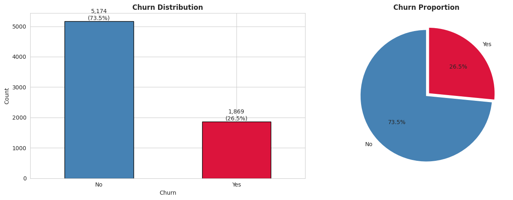
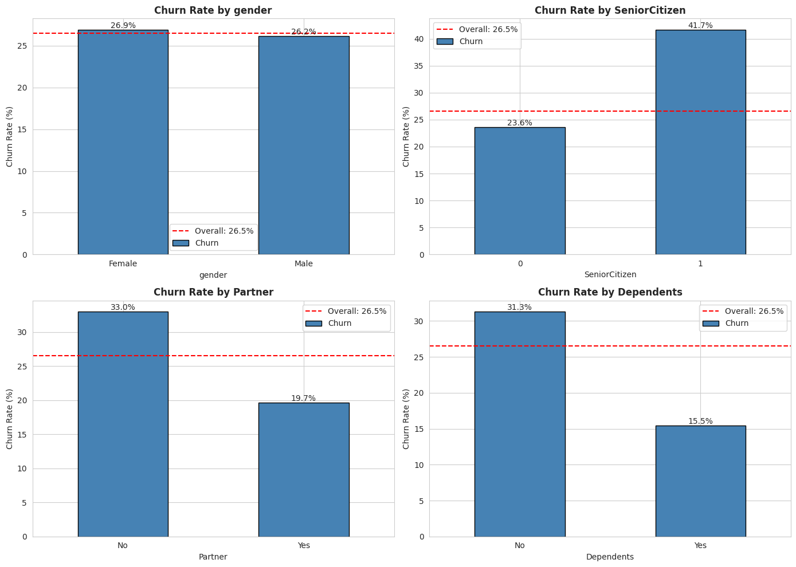
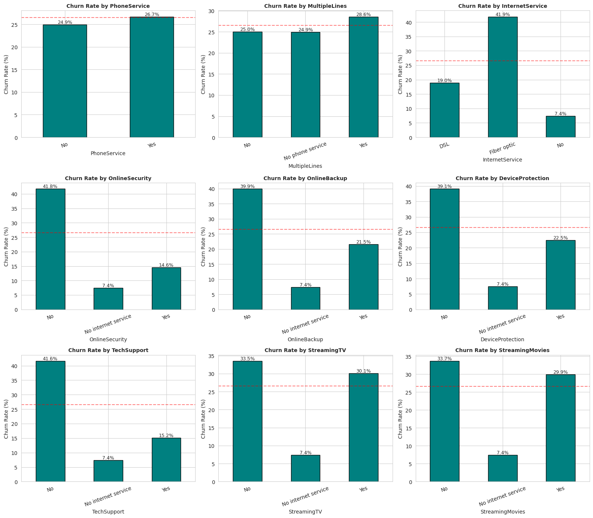
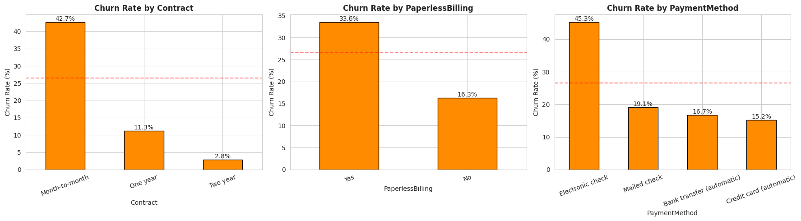
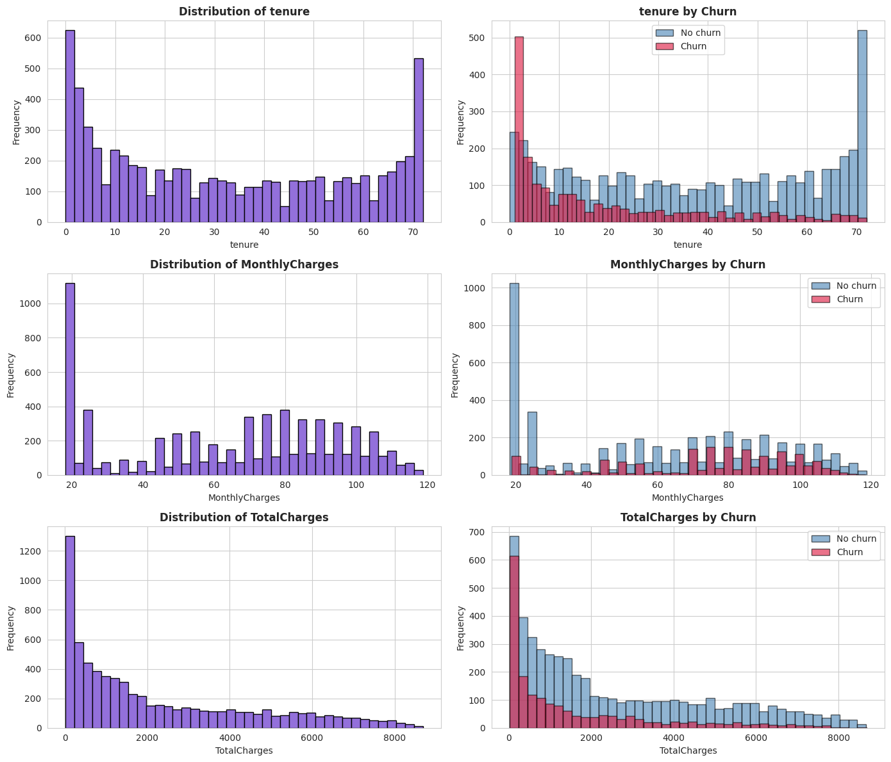
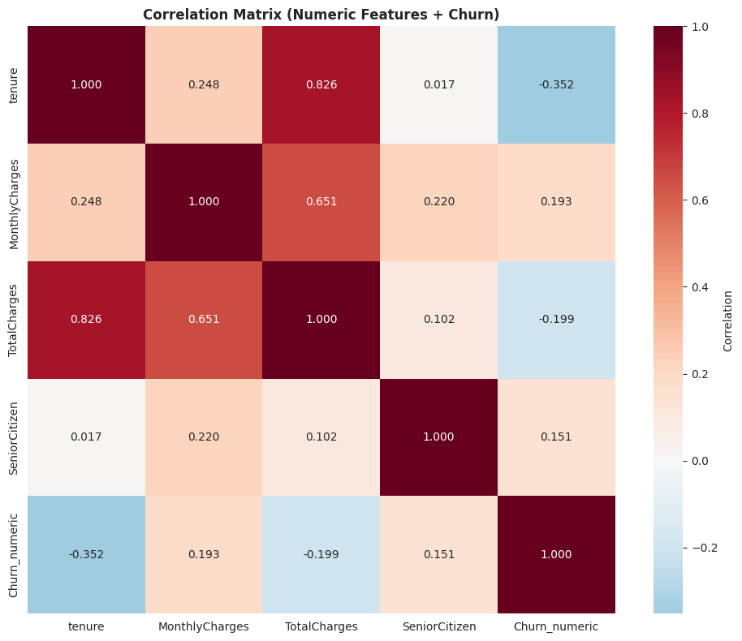

# Telco Customer Churn — EDA Findings

**Project:** Churn-CLV Prediction Suite
**Notebook:** `notebooks/01_eda_telco.ipynb`
**Dataset:** Telco Customer Churn (Kaggle, IBM-sourced)
**Total Records:** 7,043 customers
**Features:** 21 columns (20 features + customerID)

---

## Document Structure

- **Section 1:** Executive Summary
- **Section 2:** Dataset Overview
- **Section 3:** Target Variable — Churn Distribution
- **Section 4:** Demographic Analysis
- **Section 5:** Service Features Analysis
- **Section 6:** Contract and Billing Analysis
- **Section 7:** Numeric Features Distribution
- **Section 8:** Correlation Analysis
- **Section 9:** Critical Findings Summary
- **Section 10:** Modeling Decisions
- **Section 11:** Feature Engineering Opportunities
- **Section 12:** Interview Talking Points

---

## 1. Executive Summary

The Telco dataset contains 7,043 customer records with a **26.54% churn rate** — moderate class imbalance that allows direct modeling without aggressive resampling. The EDA revealed seven main predictive signals, ranked by strength:

1. **Contract type** is the single strongest predictor (15× difference between month-to-month and two-year contracts)
2. **Tenure** correlates negatively with churn (-0.352)
3. **Payment method** matters dramatically (3× difference between electronic check and automatic methods)
4. **Internet service type** — fiber optic users churn 2.2× more than DSL
5. **Add-on services** (security, backup, support) reduce churn by 2.7× when present
6. **Demographics** — senior citizens churn 1.77× more than younger customers
7. **Monthly charges** show positive correlation with churn (+0.193)

These findings translate directly into actionable business insights: incentivize long-term contracts, focus on first-six-months onboarding, push automatic payment methods, and invest in fiber service quality.

---

## 2. Dataset Overview

### Schema and Data Types

The dataset contains 21 columns covering:

- **Identifier:** `customerID`
- **Demographics:** `gender`, `SeniorCitizen`, `Partner`, `Dependents`
- **Account:** `tenure`, `Contract`, `PaperlessBilling`, `PaymentMethod`
- **Services:** `PhoneService`, `MultipleLines`, `InternetService`, `OnlineSecurity`, `OnlineBackup`, `DeviceProtection`, `TechSupport`, `StreamingTV`, `StreamingMovies`
- **Charges:** `MonthlyCharges`, `TotalCharges`
- **Target:** `Churn`

### Data Quality

| Column | Issue | Resolution |
|---|---|---|
| `TotalCharges` | Stored as `object` (string) | Convert to numeric via `pd.to_numeric(errors='coerce')` |
| `TotalCharges` | 11 rows have empty string `" "` | All have `tenure=0` (new customers) — needs imputation or removal |

No other missing values in the dataset.

### Critical Discovery: TotalCharges Issue

When examining the 11 rows with non-numeric `TotalCharges`:

| Pattern | Observation |
|---|---|
| `tenure` value | All equal to 0 |
| `MonthlyCharges` | Valid (e.g., 52.55, 20.25) |
| `Churn` | All "No" |

**Interpretation:** These are brand-new customers who have not yet been billed. They cannot churn yet. **Recommendation:** Impute `TotalCharges = 0` or drop these 11 rows. Both approaches are defensible.

---

## 3. Target Variable — Churn Distribution



### Distribution

| Class | Count | Percentage |
|---|---|---|
| No (retained) | 5,174 | 73.46% |
| Yes (churned) | 1,869 | 26.54% |

### Interpretation

The churn rate of 26.54% is **higher than industry average** (typically 15-20% annually for telcos). This indicates either:
- The data represents a problem period for the company
- The data is intentionally enriched with churn examples for modeling

### Implications for Modeling

**Class imbalance is moderate, not severe.** This affects the modeling strategy:

- **Naive baseline accuracy = 73.5%** — any model worth shipping must beat this
- **Class weighting is sufficient** — `class_weight='balanced'` in scikit-learn
- **SMOTE oversampling not necessary** — would add complexity without clear benefit at this imbalance level
- **Primary metric should be ROC-AUC or PR-AUC** — accuracy alone is misleading
- **Threshold tuning critical** — default 0.5 likely suboptimal for cost-sensitive deployment

---

## 4. Demographic Analysis



### Gender — Negligible Effect

| Gender | Churn Rate |
|---|---|
| Female | 26.9% |
| Male | 26.2% |

The 0.7 percentage point difference is statistically insignificant. **Gender is not a useful predictor**, which is also good for fairness — the model will not produce gender-biased predictions.

### Senior Citizen — Strong Signal

| Senior Citizen | Churn Rate |
|---|---|
| No (0) | 23.6% |
| Yes (1) | **41.7%** |

Senior citizens churn at **1.77× the rate** of younger customers. Likely explanations:
- Lower comfort with technology leads to frustration with service issues
- Often on fixed income, more price-sensitive
- May live with younger family members who handle telecom decisions

This will likely appear as a top SHAP feature.

### Partner — Strong Signal

| Has Partner | Churn Rate |
|---|---|
| No | 33.0% |
| Yes | 19.7% |

Single customers churn **1.67× more**. Reasons:
- Single people relocate more frequently → service changes
- Partners share infrastructure (Wi-Fi, family plans) creating switching friction

### Dependents — Strongest Demographic Signal

| Has Dependents | Churn Rate |
|---|---|
| No | 31.3% |
| Yes | **15.5%** |

Customers with dependents churn at **half the rate**. Families create deep service entrenchment — multiple devices, shared streaming subscriptions, and high switching costs.

### Demographic Summary

The pattern is consistent: **stable life situations correlate with low churn**. The combination of senior + single + no dependents would represent the highest-risk demographic profile.

---

## 5. Service Features Analysis



### Phone Service — Weak Signal

Both panels (`PhoneService`, `MultipleLines`) show negligible differences. PhoneService is universal (90% of customers) so it lacks discriminative power.

### Internet Service — Critical Discovery

| Internet Service | Churn Rate |
|---|---|
| DSL | 19.0% |
| **Fiber optic** | **41.9%** |
| No internet | 7.4% |

Fiber optic customers churn at **2.2× the rate of DSL customers**. This is a well-known telecom industry pattern:

- **Fiber commands premium pricing**, raising customer expectations
- **Service issues become deal-breakers** when paying premium rates
- **Competitors also offer fiber**, making switching attractive
- Fiber customers are more **price-aware** because their bills are higher

The "No internet" group (7.4% churn) represents stable phone-only customers — the lowest-risk segment.

**Business implication:** Quality of service investments should prioritize the fiber customer experience.

### Add-on Services — Loyalty Indicators

The four add-on services show remarkably similar patterns:

| Service | "Yes" Churn | "No" Churn | Ratio |
|---|---|---|---|
| OnlineSecurity | 14.6% | 41.8% | 2.86× |
| OnlineBackup | 21.5% | 39.9% | 1.86× |
| DeviceProtection | 22.5% | 39.1% | 1.74× |
| TechSupport | 15.2% | 41.6% | 2.74× |

Customers without these add-ons churn at roughly 2-3× the rate. Two interpretations:

1. **Add-ons create stickiness** — bundled services raise switching costs
2. **Selection effect** — customers who add services are inherently more engaged

The reality is likely a mix of both. The critical observation is that these four features show **highly correlated patterns**, suggesting potential multicollinearity in modeling.

### Streaming Services — Marginal Effect

`StreamingTV` and `StreamingMovies` show only modest churn differences (~3 percentage points), likely because most internet-having customers use one or both anyway.

---

## 6. Contract and Billing Analysis



### Contract Type — The Strongest Predictor

| Contract | Churn Rate |
|---|---|
| **Month-to-month** | **42.7%** |
| One year | 11.3% |
| Two year | 2.8% |

The 15.3× difference between month-to-month and two-year contracts is **the most extreme pattern in the entire dataset**. Mechanisms:

- Month-to-month customers face zero termination cost — they can leave at will
- Two-year contracts have early termination fees creating financial friction
- The contract choice itself signals customer commitment intent at signup

**Strategic implication:** Telecoms aggressively discount long-term contracts because they're effectively buying churn reduction.

### Paperless Billing — Counterintuitive Signal

| Paperless Billing | Churn Rate |
|---|---|
| Yes | 33.6% |
| No | 16.3% |

Surprisingly, paperless billers churn **2× more** than paper billers. The expected logic — "modern customers, savvy, low churn" — is backwards.

**Real explanation:** Paperless billing is a **proxy for customer demographics**:
- Paperless preference correlates with younger, digitally-native customers
- These customers shop alternatives online, compare prices, switch easily
- Paper billers tend to be older, more traditional, less likely to research alternatives

### Payment Method — Second Strongest Predictor

| Payment Method | Churn Rate |
|---|---|
| **Electronic check** | **45.3%** |
| Mailed check | 19.1% |
| Bank transfer (automatic) | 16.7% |
| Credit card (automatic) | 15.2% |

Electronic check users churn at **3× the rate** of automatic payment users. Two factors at work:

**1. Manual vs Automatic Payment Mechanism**
- Automatic payments execute without customer action — creating switching friction
- Manual payments require monthly opt-in — creating monthly opt-out opportunities

**2. Demographic Proxy**
- Electronic check users often lack credit cards → potentially lower-income segment
- Manual payment also correlates with younger, digital-first users

**Business action:** Incentivize migration to automatic payment as a churn reduction strategy.

---

## 7. Numeric Features Distribution



### Tenure — Bimodal Distribution

The overall distribution (left panel, top row) shows a **U-shape**:
- Large peak at 0-5 months (new customers)
- Second peak at 65-72 months (long-term loyalists)
- Lower density in the middle (30-50 months)

This indicates two customer populations: **rapid acquisition** producing many new customers, plus a **legacy loyal base** of long-term customers. The middle group is underrepresented — suggesting customers either churn early or stay for years.

### Tenure by Churn — The First-Six-Months Pattern

The right panel reveals the most actionable pattern in the entire dataset:

```
Tenure 0-3 months churned: ~500
Tenure 60+ months churned: ~50
```

**Customers who leave do so within the first six months.** Beyond the first year, churn drops dramatically.

**Strategic implication:** The customer success investment should concentrate on the first six months. Onboarding programs, proactive service checks, and loyalty incentives during this window will have the highest ROI.

### MonthlyCharges — Two Customer Tiers

The distribution shows two segments:
- ~$20 cluster: phone-only customers (low ARPU)
- ~$70-90 range: full-service customers (high ARPU)

Churn is concentrated in the higher tier. The $20 customers are stable (simple needs, no friction), while the $70-90 customers feel pricing pressure and shop alternatives.

Correlation with churn: **+0.193** (positive but moderate).

### TotalCharges — Redundant with Tenure

Right-skewed distribution. Critically, **TotalCharges has 0.83 correlation with tenure** — they encode largely the same information (since `TotalCharges ≈ MonthlyCharges × tenure`).

**Modeling implication:** Including both creates multicollinearity for linear models. Either:
- Drop `TotalCharges`
- Engineer a new feature like `avg_monthly_charge = TotalCharges / max(tenure, 1)`

---

## 8. Correlation Analysis



### Correlations with Churn

| Feature | Correlation | Interpretation |
|---|---|---|
| **tenure** | **-0.352** | Strongest single feature, longer tenure → lower churn |
| MonthlyCharges | +0.193 | Higher charges → higher churn |
| TotalCharges | -0.199 | Higher cumulative spending → lower churn (proxy for tenure) |
| SeniorCitizen | +0.151 | Senior citizens churn more |

### Multicollinearity Concerns

| Feature Pair | Correlation | Risk |
|---|---|---|
| tenure ↔ TotalCharges | 0.826 | **Severe** — features encode same information |
| MonthlyCharges ↔ TotalCharges | 0.651 | Moderate |
| SeniorCitizen ↔ MonthlyCharges | 0.220 | Minor — seniors choose more expensive plans |

### Implications by Model Type

**Tree-based models (Random Forest, XGBoost, LightGBM):**
- Multicollinearity not a problem — trees automatically handle correlated features
- Can leave both `tenure` and `TotalCharges` in

**Linear models (Logistic Regression):**
- High correlation makes coefficients unstable and uninterpretable
- Drop `TotalCharges` or replace with engineered feature

---

## 9. Critical Findings Summary

### Top Predictors Ranked

1. **Contract** — month-to-month is 15.3× more churn-prone than two-year
2. **Tenure** — first six months are critical, churn risk drops sharply after
3. **PaymentMethod** — electronic check is 3× more churn-prone than automatic methods
4. **InternetService** — fiber optic users churn 2.2× more than DSL
5. **OnlineSecurity / TechSupport** — absence indicates 2.7-2.9× higher churn
6. **MonthlyCharges** — higher charges correlate with higher churn
7. **PaperlessBilling** — proxy for digital-native demographic
8. **SeniorCitizen** — 1.77× higher churn than non-seniors

### Weak Predictors

- `gender` — negligible effect, candidate for removal
- `PhoneService` — universal (90% have it), low discriminative power
- `MultipleLines`, `StreamingTV`, `StreamingMovies` — minor effects

### The "Customer Profile" View

Combining the strongest features creates a customer risk profile:

**Highest Risk:**
- Month-to-month contract
- Tenure < 6 months
- Electronic check payment
- Fiber optic internet
- No add-on services
- Senior citizen
- Single, no dependents

A customer matching all of these would have predicted churn probability likely above 70%.

**Lowest Risk:**
- Two-year contract
- Tenure > 24 months
- Automatic payment
- DSL or no internet
- Multiple add-on services
- Has dependents

Predicted churn probability likely below 5%.

---

## 10. Modeling Decisions

Based on EDA, the following modeling choices are justified:

### Class Balance Strategy

**Decision:** Apply `class_weight='balanced'` in all classifiers.

**Reasoning:** 26.5% churn rate is moderate imbalance. SMOTE would add complexity without clear benefit and risks introducing artifacts. Class weighting is sufficient and well-tested.

### Primary Evaluation Metrics

**Decision:** Report ROC-AUC, PR-AUC, F1, and Recall@TopDecile (business-relevant). Avoid using accuracy as the headline metric.

**Reasoning:** Accuracy at 73.5% is achievable by predicting "no churn" for everyone. Need metrics that measure ability to identify the minority class.

### Train/Test Split

**Decision:** 80/20 stratified split on `Churn`, `random_state=42`.

**Reasoning:** Stratification preserves the 26.5% churn rate in both sets, ensuring fair evaluation. No temporal dimension exists in this dataset (snapshot data), so random split is appropriate.

### Feature Selection

**Decision:** Drop `customerID` (identifier), keep all other features for tree-based models. For linear models, drop `TotalCharges` to address multicollinearity.

### Categorical Encoding

**Decision:** One-hot encoding for nominal categoricals (Contract, PaymentMethod, etc.). Yes/No binary columns convert directly to 0/1.

**Reasoning:** Tree-based models handle one-hot well. CatBoost can use raw categoricals natively if we want to compare.

---

## 11. Feature Engineering Opportunities

Several engineered features are likely to add predictive value:

### Tenure-Based Features

```python
df['is_new_customer'] = (df['tenure'] < 6).astype(int)
df['is_long_term'] = (df['tenure'] >= 24).astype(int)
```

The first-six-months pattern is strong enough to warrant an explicit feature.

### Charge-Based Features

```python
df['avg_monthly_charge'] = df['TotalCharges'] / df['tenure'].replace(0, 1)
df['monthly_to_total_ratio'] = df['MonthlyCharges'] / (df['TotalCharges'] + 1)
```

These derived features can capture spending pattern stability.

### Service Aggregation

```python
addon_columns = ['OnlineSecurity', 'OnlineBackup', 'DeviceProtection', 'TechSupport']
df['num_addons'] = (df[addon_columns] == 'Yes').sum(axis=1)
df['streaming_count'] = (df[['StreamingTV', 'StreamingMovies']] == 'Yes').sum(axis=1)
```

Reduces multicollinearity among add-on services and creates an interpretable engagement score.

### Payment Method Simplification

```python
df['auto_payment'] = df['PaymentMethod'].isin([
    'Bank transfer (automatic)', 'Credit card (automatic)'
]).astype(int)
```

Captures the automatic vs manual payment dimension explicitly.

### Risk Profile Score (Optional)

A simple risk score combining the strongest predictors:

```python
df['risk_score'] = (
    (df['Contract'] == 'Month-to-month').astype(int) * 3 +
    (df['tenure'] < 6).astype(int) * 2 +
    (df['PaymentMethod'] == 'Electronic check').astype(int) * 2 +
    (df['InternetService'] == 'Fiber optic').astype(int) * 1
)
```

This is essentially a hand-built decision tree but can serve as a baseline benchmark.

---

## 12. Interview Talking Points

These are concrete sentences directly usable when discussing the project:

**1. "The single strongest predictor in the Telco dataset is contract type. Month-to-month customers churn at 42.7%, while two-year contract customers churn at only 2.8% — a 15-fold difference. This explains why telcos heavily discount long-term contracts; they're effectively buying churn reduction."**

**2. "Tenure analysis revealed a critical first-six-months pattern. Most customers who churn do so in their first half-year. This insight has immediate business application: customer success investment should concentrate on the early relationship period for maximum ROI."**

**3. "Payment method showed a 3× churn difference between electronic check and automatic methods. The mechanism is partly psychological — automatic payments create switching friction, while manual payments create monthly opt-out opportunities. Migrating customers to auto-payment would be a clear churn reduction lever."**

**4. "Fiber optic customers ironically churn 2.2× more than DSL customers. This counterintuitive pattern is well-known in telecom: fiber commands premium pricing, raising expectations, so any service quality issue becomes a deal-breaker. The action item is investing in fiber service quality, not just acquisition."**

**5. "I found that paperless billing customers churn 2× more than paper billing customers — counterintuitive at first glance. The explanation is that paperless billing acts as a proxy for younger, digital-native customers who actively shop alternatives. The lesson here is that features can encode demographic information indirectly."**

**6. "The class imbalance is moderate at 26.5% — significant but not extreme. This led to my decision to use class weighting rather than SMOTE. SMOTE adds complexity and synthetic-data artifacts; for moderate imbalance, balanced class weights are sufficient and more interpretable."**

**7. "I identified multicollinearity between tenure and TotalCharges (correlation 0.83) since the latter is essentially MonthlyCharges × tenure. For tree-based models this isn't a problem, but for linear models I'd drop TotalCharges or replace it with avg_monthly_charge to keep coefficients interpretable."**

**8. "Eleven customers had blank TotalCharges values — investigation showed all had tenure=0, meaning they were brand new and hadn't been billed yet. None had churned. This is a meaningful EDA finding: the missing values aren't random, they encode customer lifecycle stage."**

---

## Files Generated

### Visualizations
- `reports/figures/01_telco_churn_distribution.png` — Target variable distribution
- `reports/figures/02_telco_demographics_churn.png` — 4-panel demographic analysis
- `reports/figures/03_telco_services_churn.png` — 9-panel service features
- `reports/figures/04_telco_contract_churn.png` — Contract and billing
- `reports/figures/05_telco_numeric_distributions.png` — Tenure, MonthlyCharges, TotalCharges
- `reports/figures/06_telco_correlation_matrix.png` — Correlation heatmap

### Notebook
- `notebooks/01_eda_telco.ipynb` — Source code for all analysis
